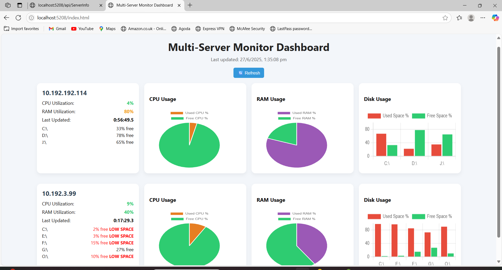

# 🖥️ Multi-Server Monitor Dashboard

A real-time dashboard to monitor multiple servers' CPU, RAM, and Disk usage, built using ASP.NET Core MVC, Chart.js, and jQuery.

## 🚀 Features

- 📡 Real-time monitoring of multiple servers
- 📈 Live charts for CPU, RAM, and Disk usage
- 💾 Visual alerts for low disk space
- 🧠 Clean and responsive UI using flexbox
- 🔄 Auto-refresh every 60 seconds

## 📷 Dashboard Preview

Each server panel displays:
- Server IP address
- CPU and RAM usage (in %)
- Disk usage for each drive (C:\, D:\, etc.)
- Timestamp of last update
- Pie charts for CPU and RAM
- Bar charts for all drives with color indicators

## 🛠️ Tech Stack

- **Backend**: ASP.NET Core MVC (.NET 6+)
- **Frontend**: Chart.js, jQuery, HTML5, CSS
- **Language**: C#
- **System Monitoring**: `System.Diagnostics`, `System.IO`

## 📂 Project Structure

ServerMonitor/
│
├── Controllers/
│ └── ServerController.cs # Gathers system metrics and returns JSON or Views
│
├── Models/
│ ├── ServerInfo.cs # Holds server data (CPU, RAM, Drives)
│ └── DriveInfoModel.cs # Drive usage model
│
├── Views/
│ └── Server/
│ ├── Index.cshtml # Main dashboard with live charts
│ └── _ServerStatsPartial.cshtml (optional)
│
├── wwwroot/
│ └── js/
│ └── monitor.js # JavaScript to fetch and draw charts (optional)
│
└── project.png # Screenshot preview

